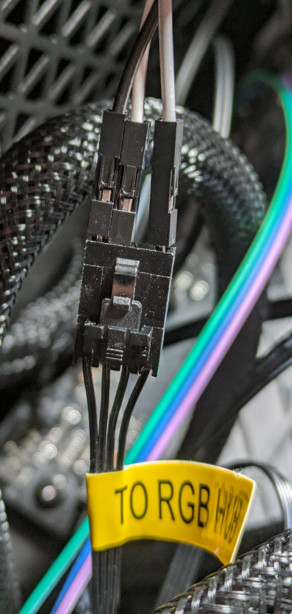

# AuraRGBFanGuide
A short guide for seamlessly integrating LL120/LL140 RGB LED fans using Aura Sync and the WS2812B protocol.

## Introduction

Did you get the Corsair RGB Fans for christmas and wondered, that you have to install two small devices, which take an internal USB 2.0 header and two SATA power connectors? And did you wonder, why you have to use the Corsair Link software to control the fans? And did you wonder, why you can't use the ASUS Aura software to control the fans? Well, I did. And I found a solution.

## What you need

* Corsair RGB Fans (LL120 or LL140)
* ASUS Motherboard with Aura Sync support (I used the ASUS ROG Strix B650E-F Wifi)
* Jumper cables (female-male)

## What you do not need

## How to do it

### Step 1: Connect the fans to the motherboard

Connect the fans to the motherboard using the 4-pin PWM connectors.

### Step 2: Connect the fans to the RGB controller

For RGB control, connect the fans to the RGB controller using 4-pin RGB connectors.
Crucially, link the data-out pin on the fan to the data-in pin on the RGB controller (the data-out pin on the RGB controller remains unused).
This requires jumper cables: connect the 2nd pin on the motherboard to the 3rd pin on the RGB controller.

### Software Integration

With this setup, ASUS Aura software now recognizes the fans as addressable RGB strips, allowing for seamless control.

Alternatively, [OpenRGB](https://openrgb.org) is an excellent choice for rgb control.
I've discovered a plugin using OpenRGB that displays CPU Load and Temperature via RGB indicators.

## More sources and information

Behind the following links you can see the connector pinout in more detail.

* [Corsair RGB Fan LED Hub](https://github.com/timkrins/corsair-rgb-fan-led-hub)
* [Corsair LL140/LL120 RGB Fan](https://github.com/timkrins/corsair-ll140-ll120-rgb-fan)
* [OPEN SOURCE RGB LIGHTING CONTROL THAT DOESN'T DEPEND ON MANUFACTURER SOFTWARE](https://openrgb.org/)
